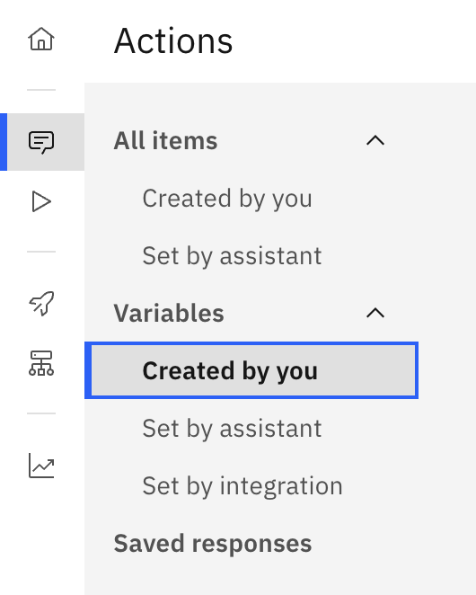
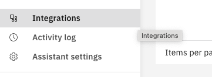
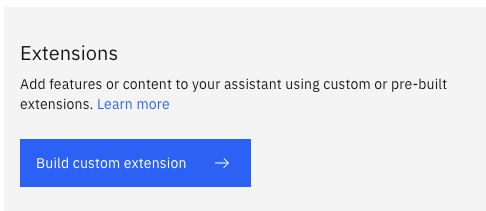
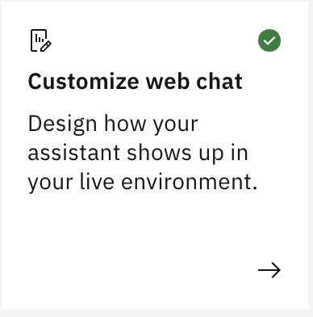

### Criar Conta IBM Cloud

- Cadastro `IBM Academic Initiative`

    [IBM Academic Initiative](https://github.com/academic-initiative/documentation/blob/main/academic-initiative/how-to/How-to-register-with-the-IBM-Academic-Initiative/readme.md)

- Obter promocode para a `IBM Cloud`

    [IBM Cloud Promocode](https://github.com/academic-initiative/documentation/blob/main/academic-initiative/how-to/How-to-request-and-IBM-Cloud-Feature-Code/readme.md)

- Ativar `IBM Cloud`

    [IBM Cloud](https://github.com/academic-initiative/documentation/blob/main/academic-initiative/how-to/How-to-create-an-IBM-Cloud-account/readme.md)

### Acesso IBM Console
- Acessar a url `https://cloud.ibm.com/`
### Uso NLU
- [Referência API](https://cloud.ibm.com/apidocs/natural-language-understanding)
- Acessar o [Google Colab](https://colab.research.google.com/)
- Instalando as bibliotecas do *python*
```bash
pip install --upgrade "ibm-watson>=8.0.0"
```
- Analisando categorias a partir de uma *url*
```python
import json
from ibm_watson import NaturalLanguageUnderstandingV1
from ibm_cloud_sdk_core.authenticators import IAMAuthenticator
from ibm_watson.natural_language_understanding_v1 import Features, CategoriesOptions

authenticator = IAMAuthenticator('{apikey}')

nlu = NaturalLanguageUnderstandingV1(
    version='2022-04-07',
    authenticator=authenticator
)

nlu.set_disable_ssl_verification(True)

nlu.set_service_url('{url}')

response = nlu.analyze(
    url='www.ibm.com',
    features=Features(categories=CategoriesOptions(limit=3))).get_result()

print(json.dumps(response, indent=2))
```
- Ao invés de passar a `url` de um *site* como parâmetro pode-se informar um texto por meio de `text`
- Outras formas de análise podem ser obtidas [aqui](https://cloud.ibm.com/apidocs/natural-language-understanding?code=python#features-examples)

#### Treinando um modelo
- Criando os dados de treinamento (criar um arquivo `training_data.json`)
```json
[
    {
        "text": "Preciso de segunda via do boleto",
        "labels": [
            "Financeiro"
        ]
    },
    {
        "text": "Posso pagar a vista?",
        "labels": [
            "Financeiro"
        ]
    },
    {
        "text": "Quero alterar a data de pagamento",
        "labels": [
            "Financeiro"
        ]
    },
    {
        "text": "Meu pagamento não foi confirmado",
        "labels": [
            "Financeiro"
        ]
    },
    {
        "text": "Meu pagamento não foi confirmado",
        "labels": [
            "Financeiro"
        ]
    },
    {
        "text": "Desejo quitar um débito",
        "labels": [
            "Financeiro"
        ]
    },
    {
        "text": "Quero saber o preço do plano premium",
        "labels": [
            "Comercial"
        ]
    },
    {
        "text": "Gostaria de contratar o serviço",
        "labels": [
            "Comercial"
        ]
    },
    {
        "text": "Quero uma cotação",
        "labels": [
            "Comercial"
        ]
    },
    {
        "text": "Gostaria de uma visita de um vendedor",
        "labels": [
            "Comercial"
        ]
    },
    {
        "text": "Preciso de uma demonstração do produto",
        "labels": [
            "Comercial"
        ]
    },
    {
        "text": "Preciso de uma ajuda com uma cotação",
        "labels": [
            "Comercial"
        ]
    }
]
```
- Carregando os dados de treinamento
```python
from ibm_watson import NaturalLanguageUnderstandingV1
from ibm_cloud_sdk_core.authenticators import IAMAuthenticator

authenticator = IAMAuthenticator('{apikey}')
nlu = NaturalLanguageUnderstandingV1(
    version='2022-04-07',
    authenticator=authenticator
)

nlu.set_disable_ssl_verification(True)

nlu.set_service_url('{url}')

with open('training_data.json', 'rb') as training_data:
    model = nlu.create_classifications_model(
        language='pt',
        training_data=training_data,
        training_data_content_type='application/json',
        model_version='1.0.0',
        name='MeuModelo',
        training_parameters={"model_type": "single_label"}
    ).get_result()

print(model)
```
- Acompanhando o *status* do treinamento (obter o `model_id`)
```python
status = nlu.get_classifications_model(model_id=model_id).get_result()
print(status['status'])
```
- Usando o modelo
```python
from ibm_watson.natural_language_understanding_v1 import Features, ClassificationsOptions

response = nlu.analyze(
    text="Quero pagar boleto",
    features=Features(
        classifications=ClassificationsOptions(model=model_id)
    )
).get_result()

print(response)
```
### Cloudant
- Banco de dados nSQL baseado em documento criado a partir do [Apache Couch Db](https://couchdb.apache.org/)
- [Referência API](https://cloud.ibm.com/apidocs/cloudant)
- Instalar pacote de integração com **Python**
```bash
pip install ibmcloudant
```
- Efetuar a conexão (trocar a `{apikey}` e `{url}`)
```python
from ibmcloudant.cloudant_v1 import Cloudan
from ibm_cloud_sdk_core.authenticators import IAMAuthenticator

authenticator = IAMAuthenticator('{apikey}')
service = CloudantV1(authenticator=authenticator)
service.set_service_url('{url}')
```
- Obter informações gerais do servidor (validar conexão)
```python
response = service.get_server_information().get_result()
print(response)
```
- Operações comuns
```python
response = service.get_all_dbs().get_result()
print(response)

response = service.put_database(db='alunos', partitioned=False).get_result()
print(response)

response = service.get_database_information(db='alunos').get_result()
print(response)

from ibmcloudant.cloudant_v1 import Document

aluno_doc = Document(
    _id="RM1002",
    nome="Mariana Alves",
    curso="Ciência da Computação",
    creditos=75)
    
response = service.post_document(db='alunos', document=aluno_doc).get_result()
print(response)

response = service.head_database(db='alunos')
print(response)
```
- Obter o arquivo de alunos
```bash
!wget https://github.com/esensato/icl-2026-01/raw/refs/heads/main/alunos.json
```
- Efetuar carga de documentos em lote
```python
import json

with open("alunos.json", "r", encoding="utf-8") as f:
    alunos = json.load(f)

response = service.post_bulk_docs(
  db='alunos',
  bulk_docs=alunos
).get_result()

print(response)
```
- Pesquisar um documento específico
```python
response = service.get_document(
  db='alunos',
  doc_id='RM1002'
).get_result()

print(response)
```
- Obter o **token** de acesso
```bash
!curl -X POST 'https://iam.cloud.ibm.com/identity/token' -H 'Content-Type: application/x-www-form-urlencoded' -d 'grant_type=urn:ibm:params:oauth:grant-type:apikey&apikey={chave_api_cloudant}'
```

### Watson Assistant
- Permite a criação de **chatbots**
- Efetuar login na [IBM Cloud](https://cloud.ibm.com)
- Instanciar o serviço [Watson Assistant](https://cloud.ibm.com/catalog/services/watsonx-assistant)
- Considerar o seguinte caso de uso:
    - Crie um assistente que auxilie alunos a faculdade "Belo Diploma" a prestar informações de forma automatizada ao seu público alvo, constituído por:
        - Alunos: uso do assistente para tarefas mais objetivas como verificar disciplicas matriculadas, notas, créditos concluídos, etc...
        - Ex-alunos: interessados em saber quais são as novidades da faculdade, suas linhas de pesquisa para eventuais cursos de extensão
        - Interessados nos cursos: alunos em potencial que desejam maiores detalhes sobre a instituição e seus cursos 
    - O assistente deve prever integração com o sistema *back-end* da universidade para prestar as informações solicitadas (quando aplicado)
- Criar o diálogo introdutório, o `On boarding`
    - Actions -> Set by assistant -> Greet customer
- Adicionar 3 variações de resposta para quando a pergunta não for compreendida pelo Chatbot (escolhidas aleatoriamente)
    - Actions -> Set by assistant -> No matches
- Criar uma ação personalizada para saber o nome do aluno
- Criar variáveis de sessão:

<div style="width:50px">

</div>

#### Integração com o sistema da universidade
- Realizar a integração com a base de dados **Cloudant**
  
<div style="width:50px;">

</div>

- Criar uma integração personalizada

<div style="width:100px; height:100px">

</div>

- Formato [OpenAPI](https://editor.swagger.io/) 
```json
{
  "openapi": "3.0.3",
  "info": {
    "title": "Cloudant Alunos API",
    "description": "API para consulta de documentos na base alunos do IBM Cloudant",
    "version": "1.0.0"
  },
  "servers": [
    {
      "url": "https://~replace-with-cloudant-host~.cloudantnosqldb.appdomain.cloud"
    }
  ],
  "paths": {
    "/alunos/_id:{id}": {
      "get": {
        "summary": "Buscar aluno por ID",
        "description": "Retorna um documento da base alunos a partir do _id.",
        "parameters": [
          {
            "name": "id",
            "in": "path",
            "required": true,
            "description": "Identificador do aluno",
            "schema": {
              "type": "string",
              "example": "1000042"
            }
          }
        ],
        "responses": {
          "200": {
            "description": "Documento encontrado",
            "content": {
              "application/json": {
                "schema": {
                  "type": "object",
                  "additionalProperties": true
                }
              }
            }
          },
          "401": {
            "description": "Não autorizado"
          },
          "404": {
            "description": "Documento não encontrado"
          }
        },
        "security": [
          {
            "bearerAuth": []
          }
        ]
      }
    }
  },
  "components": {
    "securitySchemes": {
      "bearerAuth": {
        "type": "http",
        "scheme": "bearer",
        "bearerFormat": "JWT"
      }
    }
  }
}
```
#### Exercícios
- Implementar novos diálogos:
    - Permitir que o aluno consulte os seus créditos
    - Permitir que o aluno deixe algum recado escrito (dúvidas, críticas, elogios, sugestões, etc...) para a secretaria

### Personalizando o chatbot
- Instalar em uma página HTML

    [Instalar Assistente](https://developer.ibm.com/tutorials/embed-watson-assistant-in-website/)

- Código inicial para exibir o chatbot em um site
    ```javascript
    <script>
      window.watsonAssistantChatOptions = {
        // A UUID like '1d7e34d5-3952-4b86-90eb-7c7232b9b540' included in the embed code provided in IBM watsonx Assistant.
        integrationID: 'YOUR_INTEGRATION_ID',
        // Your assistants region e.g. 'us-south', 'us-east', 'jp-tok' 'au-syd', 'eu-gb', 'eu-de', etc.
        region: 'YOUR_REGION',
        // A UUID like '6435434b-b3e1-4f70-8eff-7149d43d938b' included in the embed code provided in IBM watsonx Assistant.
        serviceInstanceID: 'YOUR_SERVICE_INSTANCE_ID',
        // The callback function that is called after the widget instance has been created.
        onLoad: async (instance) => {
          await instance.render();
        }
      };
      setTimeout(function(){const t=document.createElement('script');t.src='https://web-chat.global.assistant.watson.appdomain.cloud/versions/' + (window.watsonAssistantChatOptions.clientVersion || 'latest') + '/WatsonAssistantChatEntry.js';document.head.appendChild(t);});
    </script>
    ```
- Para obter um exemplo, clicar em
    <div style="width:100px; height:100px">
    
    </div>

- E em seguida, clicar na aba superior **Embed**
- `onLoad` executado quando o chatbot é carregado
- Configurações de *layout*
    ```json
        layout: {
            showFrame: true,
            hasContentMaxWidth: false,
        }
    ```
- Configurações do tema
    ```json
        themeConfig: {
            carbonTheme: 'g100',
            corners: 'round',
        }
    ```
- Obs: `carbonTheme` podem ser "white", "g10", "g90" ou "g100" e `corner` "square" ou "round"
- Botão para fechar o chatbot
    ```json
        headerConfig: {
            closeButtonIconType: 'side-panel-left',
        }
    ```
- Obs: opções "minimize", "close", "side-panel-left" e "side-panel-right".
#### Eventos
- Lista de eventos completa pode ser encontrada [Aqui](https://web-chat.global.assistant.watson.cloud.ibm.com/docs.html?to=api-events#event-list)
    ```javascript
        instance.on({
            type: 'receive', handler: (event) => { console.log('I received a message!', event); }
        });
    ```
- Evento `receive`: executado quando uma mensagem é recebida;
- - Os principais parâmetros recebidos pelas funçõs na varável `event` são:
    - `event.data`: mensagem (dados) recebidos pelo chatbot como respostas das intenções do usuário;
    - `event.data.output.generic`: itens da resposta recebidos (texto, etc...)
- Evento `pre:receive`: executado antes do `receive`;
    ```javascript
        instance.on({
            type: 'pre:receive', handler: (event) => {
                console.log('pre:receive')
                const message = event.data;
                if (message.output.generic) {
                    message.output.generic.forEach(messageItem => {
                        console.log(messageItem);
                        if (messageItem.response_type === 'text') {
                            messageItem.response_type = 'teste123';
                        }
                    })
                }
            }
        });
    ```

- Evento `customResponse`: permite criar uma resposta personalizada;
    ```javascript
        function customResponseHandler(event) {
            const { message, element, fullMessage } = event.data;

            const div = document.createElement('div');
            // obtem o texto da mensagem
            div.innerHTML = message.text;
            div.style.border = 'solid 1px';
            div.style.color = 'red';

            // message.options.forEach((messageItem, index) => {
            //     const button = document.createElement('button');
            //     button.innerHTML = messageItem.label;
            //     button.classList.add('CardButton');
            //     button.addEventListener('click', () => onClick(messageItem, button, fullMessage, index));
            //     element.appendChild(button);
            // });

            element.appendChild(div);

        }
    ```
### Conectar DB2
- Para referência à API clicar [aqui](https://cloud.ibm.com/apidocs/db2-on-cloud/db2-on-cloud-v4)
- Definir as variáveis para a obter o token de conexão
```python
url = ""
userid = ""
password = ""
deployment_id = ""
```
- Obter o token (exemplo em *python*)
```python
import http.client
import ssl
import json

context = ssl._create_unverified_context()

conn = http.client.HTTPSConnection(url, context=context)

payload = {"userid":userid,"password":password}

headers = {
    'content-type': "application/json",
    'x-deployment-id': deployment_id
    }

conn.request("POST", "/dbapi/v4/auth/tokens", json.dumps(payload), headers)

res = conn.getresponse()
data = res.read()

print(json.loads(data.decode("utf-8"))["token"])
```
- Obter o token (exemplo [OpenAPI](https://editor.swagger.io/))
- Trocar `"url": "https://{HOSTNAME}"` pelo *hostname* fornecido nas credencias do DB2 criado na cloud
```json
{
  "openapi": "3.0.3",
  "info": {
    "title": "DB API Authentication",
    "version": "1.0.0",
    "description": "Endpoint para autenticação e geração de token."
  },
  "servers": [
    {
      "url": "https://{HOSTNAME}"
    }
  ],
  "paths": {
    "/dbapi/v4/auth/tokens": {
      "post": {
        "summary": "Generate authentication token",
        "operationId": "generateAuthToken",
        "parameters": [
          {
            "name": "x-deployment-id",
            "in": "header",
            "required": true,
            "schema": {
              "type": "string"
            },
            "description": "Deployment identifier"
          }
        ],
        "requestBody": {
          "required": true,
          "content": {
            "application/json": {
              "schema": {
                "type": "object",
                "required": [
                  "userid",
                  "password"
                ],
                "properties": {
                  "userid": {
                    "type": "string",
                    "example": "user123"
                  },
                  "password": {
                    "type": "string",
                    "example": "mypassword"
                  }
                }
              }
            }
          }
        },
        "responses": {
          "200": {
            "description": "Authentication token generated",
            "content": {
              "application/json": {
                "schema": {
                  "type": "object",
                  "properties": {
                    "userid": {
                      "type": "string",
                      "example": "user123"
                    },
                    "token": {
                      "type": "string",
                      "example": "eyJhbGciOiJIUzI1NiIsInR5cCI6IkpXVCJ9..."
                    }
                  }
                }
              }
            }
          }
        }
      }
    }
  }
}
```
- Armazenar o *token* em uma variável
- Efetuar uma consulta *SQL* ao banco de dados e obter o `id` da execução (assíncrona)
```python
import http.client
import ssl
import json

context = ssl._create_unverified_context()

conn = http.client.HTTPSConnection(url, context=context)

payload = {"commands":"select * from disciplinas", "separator":";","stop_on_error":"no"}

headers = {
    'content-type': "application/json",
    'authorization': f"Bearer {token}",
     'x-deployment-id': deployment_id
}

conn.request("POST", "/dbapi/v4/sql_jobs", json.dumps(payload), headers)

res = conn.getresponse()
data = res.read()

print(json.loads(data.decode("utf-8"))["id"])
```
- Obter o restulado final da execução (atualizar o `id`)
```bash
import http.client
import ssl
import json

context = ssl._create_unverified_context()

conn = http.client.HTTPSConnection(url, context=context)

headers = {
    'content-type': "application/json",
    'authorization': f"Bearer {token}",
     'x-deployment-id': deployment_id
}

conn.request("GET", f"/dbapi/v4/sql_jobs/1772644599186_733471460", headers=headers)

res = conn.getresponse()
data = res.read()

print(data.decode("utf-8"))
```
